# 화면 설계서

## 1. 문서 개요

| 항목 | 내용 |
|---|---|
| 프로젝트명 | 노동OK - AI 기반 노동법 상담 서비스 |
| 작성 목적 | 주요 화면별 목적, URL/View/Template 매핑, UI 요소, 이벤트, 유효성 검사, 화면 이동 흐름을 정의한다. |
| 작성 기준 | Django URL/View/Template 및 정적 JS 이벤트 구현 기준 |
| 화면 ID 규칙 | `SC-{앱번호}.{순번}` 형식. 예: `SC-2.1` |

## 2. 화면 목록

| 화면 ID | 구분 | 화면명 | URL | View | Template |
|---|---|---|---|---|---|
| SC-1.1 | 공통 | 랜딩 | `/` | `landing` | `labor/landing.html` |
| SC-1.2 | 공통 | 사용자 홈 | `/` | `landing` | `labor/landing.html` |
| SC-2.1 | 인증 | 로그인 | `/login/` | `login_view` | `labor/login.html` |
| SC-2.2 | 인증 | 회원가입 | `/register/` | `register_view` | `labor/register.html` |
| SC-3.1 | 사용자 앱 | AI 노동법 상담 | `/app/?page=home` | `user_app` | `labor/app.html`, `_advice.html` |
| SC-3.2 | 사용자 앱 | 수당 계산기 | `/app/?page=calculator` | `user_app`, `calculate_api` | `labor/app.html`, `_calculator.html` |
| SC-3.3 | 사용자 앱 | 최신 노동법 뉴스 | `/app/?page=news` | `user_app`, `news_api` | `labor/app.html`, `_news.html` |
| SC-3.4 | 사용자 앱 | 마이페이지 | `/app/?page=mypage` | `user_app` | `labor/app.html`, `_mypage.html` |
| SC-4.1 | 관리자 | 관리자 대시보드 | `/admin-console/?tab=dashboard` | `admin_console` | `labor/admin.html`, `_admin_dashboard.html` |
| SC-4.2 | 관리자 | 사용자 관리 | `/admin-console/?tab=users` | `admin_console` | `labor/admin.html`, `_admin_users.html` |
| SC-4.3 | 관리자 | 피드백 관리 | `/admin-console/?tab=feedback` | `admin_console` | `labor/admin.html`, `_admin_feedback.html` |
| SC-4.4 | 관리자 | 프롬프트 관리 | `/admin-console/?tab=prompts` | `admin_console`, `prompt_api` | `labor/admin.html`, `_admin_prompts.html` |
| SC-4.5 | 관리자 | 데이터 / 벡터DB 관리 | `/admin-console/?tab=vectordb` | `admin_console` | `labor/admin.html`, `_admin_vectordb.html` |
| SC-4.6 | 관리자 | 성능 모니터링 | `/admin-console/?tab=performance` | `admin_console` | `labor/admin.html`, `_admin_performance.html` |

---

## SC-1.1 랜딩

| 항목 | 내용 |
|---|---|
| URL | `/` |
| View | `landing` |
| Template | `labor/landing.html` |
| Model / 데이터 | `data_sources`, `feature_cards`, `steps` context |

### 와이어프레임 캡처

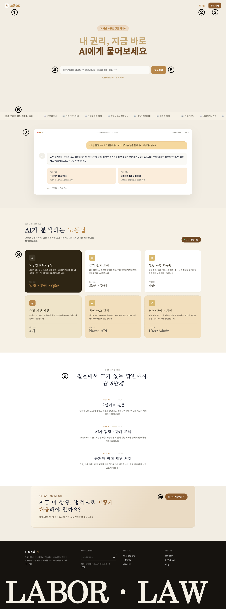

### 화면 설명

비로그인 사용자가 처음 진입하는 서비스 소개 화면이다. 서비스의 핵심 기능, 데이터 출처, 예시 상담 UI, 이용 방법, 회원가입 CTA를 제공한다. 이미 로그인한 사용자는 역할에 따라 사용자 앱 또는 관리자 콘솔로 리다이렉트된다.

### UI 요소 명세

| 번호 | 요소명 | 타입 | 설명 |
|---|---|---|---|
| ① | 브랜드 로고 | Link | 클릭 시 랜딩 화면으로 이동 |
| ② | 로그인 링크 | Link | `/login/` 이동 |
| ③ | 무료 시작 버튼 | Link/Button | `/register/` 이동 |
| ④ | 질문 입력란 | Input(text) | 상담 예시 질문 입력 |
| ⑤ | 질문하기 버튼 | Button | 로그인 화면으로 이동 |
| ⑥ | 데이터 출처 티커 | Marquee/Scroll 영역 | 법령, 판례, 행정해석 등 데이터 출처 표시 |
| ⑦ | 상담 예시 목업 | Display Card | 사용자 질문, AI 답변, 근거 카드 예시 표시 |
| ⑧ | 기능 카드 6개 | Card | 실제 구현된 핵심 기능 요약 |
| ⑨ | 이용 단계 영역 | Step List | 질문-분석-답변 저장 흐름 안내 |
| ⑩ | CTA 버튼 | Link/Button | `/register/` 이동 |

### 기능 / 이벤트 설명

| 이벤트 | 처리 흐름 |
|---|---|
| 로그인 클릭 | `/login/`으로 이동 |
| 무료 시작 / CTA 클릭 | `/register/`로 이동 |
| 질문하기 클릭 | 입력값과 관계없이 로그인 후 이용하도록 `/login/`으로 이동 |
| 로그인 상태에서 `/` 접근 | `landing` view에서 `_home_for()` 호출 후 사용자 앱 또는 관리자 콘솔로 redirect |

### 유효성 검사 / 예외 처리

| 항목 | 내용 |
|---|---|
| 질문 입력 | 현재는 필수 검증 없음. 로그인 유도 목적의 입력란 |
| 로그인 사용자 접근 | 사용자: `/app/`, 관리자: `/admin-console/`로 자동 이동 |

### 연관 화면

| 조건 | 이동 화면 |
|---|---|
| 로그인 클릭 | SC-2.1 로그인 |
| 무료 시작 클릭 | SC-2.2 회원가입 |
| 로그인 완료 사용자 접근 | SC-1.2 사용자 홈 |

---

## SC-1.2 사용자 홈

| 항목 | 내용 |
|---|---|
| URL | `/app/` |
| View | `app_home` |
| Template | `labor/app_home.html` |
| Model / 데이터 | `data_sources`, `feature_cards`, `steps` context, Session `labor_user` |

### 와이어프레임 캡처
 
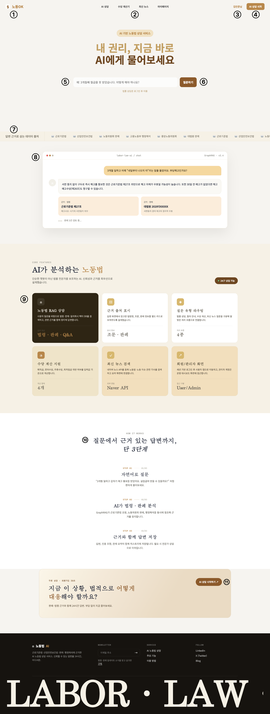
 
### 화면 설명
 
로그인을 완료한 일반 사용자가 접근하는 홈 화면이다. SC-1.1 랜딩과 레이아웃 및 구성 요소는 동일하나, 상단에 서비스 내 주요 화면으로 이동할 수 있는 네비게이션 바가 추가되고, 로그인 여부에 따라 상단 우측 영역과 질문 입력 동작이 달라진다.
 
### UI 요소 명세
 
| 번호 | 요소명 | 타입 | 설명 |
|---|---|---|---|
| ① | 브랜드 로고 | Link | 클릭 시 SC-1.2 화면으로 이동 |
| ② | 네비게이션 바 | Nav | AI 상담 / 수당 계산기 / 최신 뉴스 / 마이페이지 메뉴 제공 |
| ③ | 사용자 이름 표시 | Text | 기존 SC-1.1의 '로그인 링크' 위치. 현재 로그인한 사용자 이름 표시 |
| ④ | AI 상담 시작 버튼 | Link/Button | 기존 SC-1.1의 '무료 시작 버튼' 위치. 클릭 시 SC-3.1 AI 노동법 상담으로 이동 |
| ⑤ | 질문 입력란 | Input(text) | 상담 질문 입력 |
| ⑥ | 질문하기 버튼 | Button | 입력한 질문을 가지고 SC-3.1 AI 노동법 상담 화면으로 이동 (SC-1.1과 달리 실제 질문이 전달됨) |
| ⑦ | 데이터 출처 티커 | Marquee/Scroll 영역 | 법령, 판례, 행정해석 등 데이터 출처 표시 |
| ⑧ | 상담 예시 목업 | Display Card | 사용자 질문, AI 답변, 근거 카드 예시 표시 |
| ⑨ | 기능 카드 6개 | Card | 실제 구현된 핵심 기능 요약 |
| ⑩ | 이용 단계 영역 | Step List | 질문-분석-답변 저장 흐름 안내 |
| ⑪ | CTA 버튼 | Link/Button | 로그인 상태이므로 클릭 시 SC-3.1 AI 노동법 상담으로 이동 |
 
### 기능 / 이벤트 설명
 
| 이벤트 | 처리 흐름 |
|---|---|
| 네비게이션 바 - AI 상담 클릭 | SC-3.1 AI 노동법 상담으로 이동 |
| 네비게이션 바 - 수당 계산기 클릭 | 수당 계산기 화면으로 이동 |
| 네비게이션 바 - 최신 뉴스 클릭 | 최신 뉴스 화면으로 이동 |
| 네비게이션 바 - 마이페이지 클릭 | 마이페이지 화면으로 이동 |
| AI 상담 시작 버튼 클릭 | SC-3.1 AI 노동법 상담으로 이동 |
| 질문 입력 후 질문하기 클릭 | 입력한 질문 값을 가지고 SC-3.1 AI 노동법 상담으로 이동, 진입 시 해당 질문 자동 반영 |
| CTA 버튼 클릭 | SC-3.1 AI 노동법 상담으로 이동 |
 
### 유효성 검사 / 예외 처리
 
| 항목 | 내용 |
|---|---|
| 질문 입력 | 빈 값 입력 시 질문하기 버튼 비활성화 또는 안내 메시지 표시 |
| 비로그인 사용자 접근 | `/app/` 접근 시 세션 `labor_user` 없으면 `/login/`으로 리다이렉트 |
 
### 연관 화면
 
| 조건 | 이동 화면 |
|---|---|
| AI 상담 메뉴 / AI 상담 시작 버튼 / 질문하기 / CTA 클릭 | SC-3.1 AI 노동법 상담 |
| 수당 계산기 메뉴 클릭 | 수당 계산기 화면 |
| 최신 뉴스 메뉴 클릭 | 최신 뉴스 화면 |
| 마이페이지 메뉴 클릭 | 마이페이지 화면 |

---

## SC-2.1 로그인

| 항목 | 내용 |
|---|---|
| URL | `/login/` |
| View | `login_view` |
| Template | `labor/login.html` |
| Model / 데이터 | Session `labor_user` |

### 와이어프레임 캡처

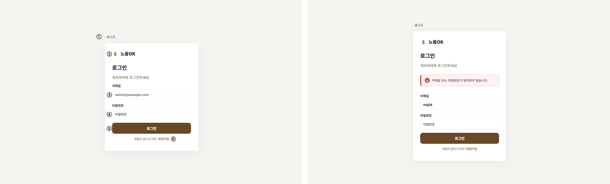

### 화면 설명

사용자가 이메일과 비밀번호를 입력해 서비스에 접근하는 인증 화면이다. 이메일에 따라 일반 사용자와 관리자를 구분한다.

### UI 요소 명세

| 번호 | 요소명 | 타입 | 설명 |
|---|---|---|---|
| ① | 홈으로 링크 | Link | `/`로 이동 |
| ② | 브랜드 로고 | Link | `/`로 이동 |
| ③ | 이메일 입력란 | Input(email) | 이메일 형식, 필수 입력 |
| ④ | 비밀번호 입력란 | Input(password) | 필수 입력 |
| ⑤ | 로그인 버튼 | Button(submit) | POST `/login/` 요청 |
| ⑥ | 회원가입 링크 | Link | `/register/` 이동 |

### 기능 / 이벤트 설명

| 이벤트 | 처리 흐름 |
|---|---|
| 로그인 버튼 클릭 | CSRF 포함 POST 요청 → `login_view` 처리 |
| `admin@example.com` 입력 | session에 role=`admin` 저장 → `/admin-console/` 이동 |
| 그 외 이메일 입력 | session에 role=`user` 저장 → `/app/` 이동 |
| 회원가입 클릭 | `/register/` 이동 |

### 유효성 검사 / 예외 처리

| 항목 | 내용 |
|---|---|
| 이메일 | HTML5 `type=email`, `required` |
| 비밀번호 | HTML5 `required` |
| 인증 실패 | 존재하지 않는 이메일 또는 비밀번호 불일치 시 `"이메일 또는 비밀번호가 일치하지 않습니다."` 표시 |
| 빈 값 | 브라우저 기본 required 메시지 표시 |

### 연관 화면

| 조건 | 이동 화면 |
|---|---|
| 관리자 로그인 성공 | SC-4.1 관리자 대시보드 |
| 일반 사용자 로그인 성공 | SC-1.2 사용자 홈 |
| 회원가입 링크 클릭 | SC-2.2 회원가입 |
| 홈으로 클릭 | SC-1.1 랜딩 |

---

## SC-2.2 회원가입

| 항목 | 내용 |
|---|---|
| URL | `/register/` |
| View | `register_view` |
| Template | `labor/register.html` |
| Model / 데이터 | Session `labor_user` |

### 와이어프레임 캡처

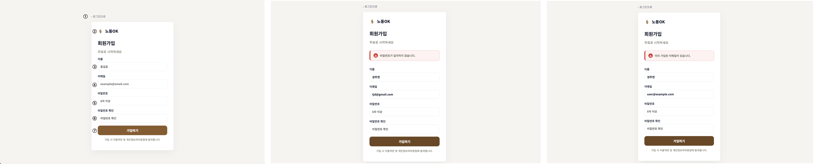

### 화면 설명

신규 사용자가 이름, 이메일, 비밀번호를 입력해 일반 사용자 계정으로 서비스를 시작하는 화면이다. 

### UI 요소 명세

| 번호 | 요소명 | 타입 | 설명 |
|---|---|---|---|
| ① | 로그인으로 링크 | Link | `/login/` 이동 |
| ② | 브랜드 로고 | Link | `/` 이동 |
| ③ | 이름 입력란 | Input(text) | 사용자 표시 이름, 필수 |
| ④ | 이메일 입력란 | Input(email) | 이메일 형식, 필수 |
| ⑤ | 비밀번호 입력란 | Input(password) | 필수 |
| ⑥ | 비밀번호 확인 입력란 | Input(password) | 필수 |
| ⑦ | 가입하기 버튼 | Button(submit) | POST `/register/` 요청 |
| ⑧ | 이용약관 안내 | Text | 가입 시 동의 안내 문구 |

### 기능 / 이벤트 설명

| 이벤트 | 처리 흐름 |
|---|---|
| 가입하기 클릭 | CSRF 포함 POST 요청 → `register_view` 처리 |
| 회원가입 성공 | session에 role=`user` 저장 → `/app/` 이동 |
| 로그인으로 클릭 | `/login/` 이동 |

### 유효성 검사 / 예외 처리

| 항목 | 내용 |
|---|---|
| 이름 | HTML5 `required` |
| 이메일 | HTML5 `type=email`, `required` |
| 비밀번호 | HTML5 `required`. 설계상 8자 이상 권장 |
| 비밀번호 확인 | 비밀번호 일치 검사 수행. 불일치 시 오류 메시지 표시 |
| 이메일 중복 | `"이미 가입된 이메일이 있습니다."` 표시 |

### 연관 화면

| 조건 | 이동 화면 |
|---|---|
| 회원가입 성공 | SC-1.2 사용자 홈 |
| 로그인으로 클릭 | SC-2.1 로그인 |

---

## SC-3.1 AI 노동법 상담

| 항목 | 내용 |
|---|---|
| URL | `/app/?page=home` |
| View | `user_app`, `advice_api` |
| Template | `labor/app.html`, `labor/partials/_advice.html` |
| JS | `static/labor/js/advice.js`, `utils.js` |
| Model / 데이터 | Session `labor_user`, `quick_questions`, API response `{ answer }` |

### 와이어프레임 캡처

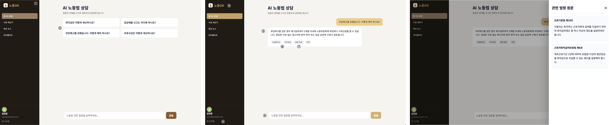

### 화면 설명

로그인한 사용자가 노동법 관련 질문을 입력하고 AI 답변을 받는 핵심 상담 화면이다. 빠른 질문 버튼과 직접 입력을 모두 지원하며, 답변 하단에는 피드백/법령 원문/저장 액션 버튼을 표시한다.

### UI 요소 명세

| 번호 | 요소명 | 타입 | 설명 |
|---|---|---|---|
| ① | 사이드바 메뉴 | Navigation | 홈, 계산기, 뉴스, 마이페이지 이동 |
| ② | 빠른 질문 영역 | Button Group | 자주 묻는 질문 클릭 입력 |
| ③ | 채팅 메시지 영역 | Chat Window | 사용자 질문과 AI 답변 표시 |
| ④ | 질문 입력란 | Input(text) | 노동법 질문 입력 |
| ⑤ | 전송 버튼 | Button(submit) | 질문 API 호출 |
| ⑥ | 답변 액션 버튼 | Button Group | 도움됐어요, 아쉬워요, 법령 원문, 저장 |
| ⑦ | 법령 원문 Drawer | Drawer/Modal | 관련 법령 원문 표시 |
| ⑧ | 로그아웃 링크 | Link | `/logout/` 호출 |
| ⑨ | 홈 화면 링크 | Link | 사용자 홈 화면으로 이동|

### 기능 / 이벤트 설명

| 이벤트 | 처리 흐름 |
|---|---|
| 빠른 질문 클릭 | 질문 텍스트를 `send()`에 전달 → 사용자 메시지 표시 → `/api/advice/` POST |
| 직접 질문 전송 | 입력값 trim → 빈 값이면 중단 → 사용자 메시지 표시 → 로딩 메시지 표시 → API 응답으로 교체 |
| 법령 원문 클릭 | `#lawDrawer.hidden = false` |
| Drawer 닫기 클릭 | `#lawDrawer.hidden = true` |
| 로그아웃 클릭 | `/logout/` → session 제거 → 랜딩 이동 |

### 유효성 검사 / 예외 처리

| 항목 | 내용 |
|---|---|
| 빈 질문 | JS에서 `trim()` 후 빈 문자열이면 API 호출 중단 |
| CSRF | `postJson()`에서 `X-CSRFToken` 헤더 포함 |
| API 실패 | 현재 JS에 명시적 catch 없음. 설계 보완 시 `"답변 생성 중 오류가 발생했습니다."` 표시 |
| 비로그인 접근 | `user_app` view에서 `/login/`으로 redirect |

### 연관 화면

| 조건 | 이동 화면 |
|---|---|
| 사이드바 계산기 클릭 | SC-3.2 수당 계산기 |
| 사이드바 뉴스 클릭 | SC-3.3 최신 뉴스 |
| 사이드바 마이페이지 클릭 | SC-3.4 마이페이지 |
| 비로그인 접근 | SC-2.1 로그인 |

---

## SC-3.2 수당 계산기

| 항목 | 내용 |
|---|---|
| URL | `/app/?page=calculator` |
| View | `user_app`, `calculate_api` |
| Template | `labor/app.html`, `labor/partials/_calculator.html` |
| JS | `static/labor/js/calculator.js`, `utils.js` |
| Model / 데이터 | `minimum_wage`, API response `{ message, result }` |

### 와이어프레임 캡처

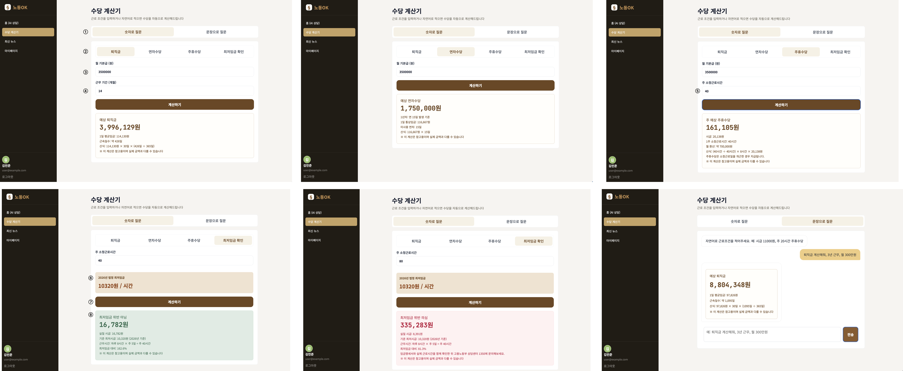

### 화면 설명

사용자가 숫자 입력 또는 자연어 입력으로 퇴직금, 연차수당, 주휴수당, 최저임금 위반 여부를 계산하는 화면이다.

### UI 요소 명세

| 번호 | 요소명 | 타입 | 설명 |
|---|---|---|---|
| ① | 계산 방식 탭 | Segmented Button | 숫자로 질문 / 문장으로 질문 전환 |
| ② | 계산 유형 탭 | Segmented Button | 퇴직금, 연차수당, 주휴수당, 최저임금 확인 |
| ③ | 월 기본급 입력란 | Input(text/number) | 급여 또는 시급 입력 |
| ④ | 근무 기간 입력란 | Input(text/number) | 퇴직금 계산 시 근무 개월 수 |
| ⑤ | 주 소정근로시간 입력란 | Input(text/number) | 주휴수당/최저임금 확인 시 표시 |
| ⑥ | 최저임금 안내 박스 | Notice Box | 최저임금 확인 유형 선택 시 표시 |
| ⑦ | 계산하기 버튼 | Button(submit) | `/api/calculate/` POST |
| ⑧ | 계산 결과 영역 | Result Box | 금액, 산식, 안내 문구 표시 |
| ⑨ | 자연어 계산 채팅창 | Chat Window | 자연어 계산 대화 표시 |
| ⑩ | 자연어 입력란 | Textarea | 문장형 계산 요청 입력 |

### 기능 / 이벤트 설명

| 이벤트 | 처리 흐름 |
|---|---|
| 계산 방식 변경 | 선택 탭 active 처리 → 해당 panel만 표시 |
| 계산 유형 변경 | `calcType` 변경 → 필요한 입력 필드 표시/숨김 |
| 숫자 계산 제출 | FormData 수집 → `/api/calculate/` POST → `renderResult()`로 결과 렌더링 |
| 자연어 계산 제출 | 빈 값 검사 → 사용자 메시지 추가 → `/api/calculate/` POST mode=`chat` → AI 메시지와 결과 표시 |

### 유효성 검사 / 예외 처리

| 항목 | 내용 |
|---|---|
| 자연어 입력 | JS에서 `trim()` 후 빈 문자열이면 호출 중단 |
| 숫자 입력 | 서버 `_float()`에서 숫자 변환 실패 시 기본값 사용 |
| API 실패 | 현재 JS에 명시적 catch 없음. 설계 보완 시 `"계산 중 오류가 발생했습니다."` 표시 |
| 참고 고지 | 결과 하단에 `"이 계산은 참고용이며 실제 금액과 다를 수 있습니다"` 표시 |

### 연관 화면

| 조건 | 이동 화면 |
|---|---|
| 사이드바 홈 클릭 | SC-3.1 AI 노동법 상담 |
| 사이드바 뉴스 클릭 | SC-3.3 최신 뉴스 |
| 사이드바 마이페이지 클릭 | SC-3.4 마이페이지 |

---

## SC-3.3 최신 노동법 뉴스

| 항목 | 내용 |
|---|---|
| URL | `/app/?page=news` |
| View | `user_app`, `news_api` |
| Template | `labor/app.html`, `labor/partials/_news.html` |
| JS | `static/labor/js/news.js` |
| Model / 데이터 | `news_categories`, `news_items`, `news_summary`, API response `{ items, summary }` |

### 와이어프레임 캡처

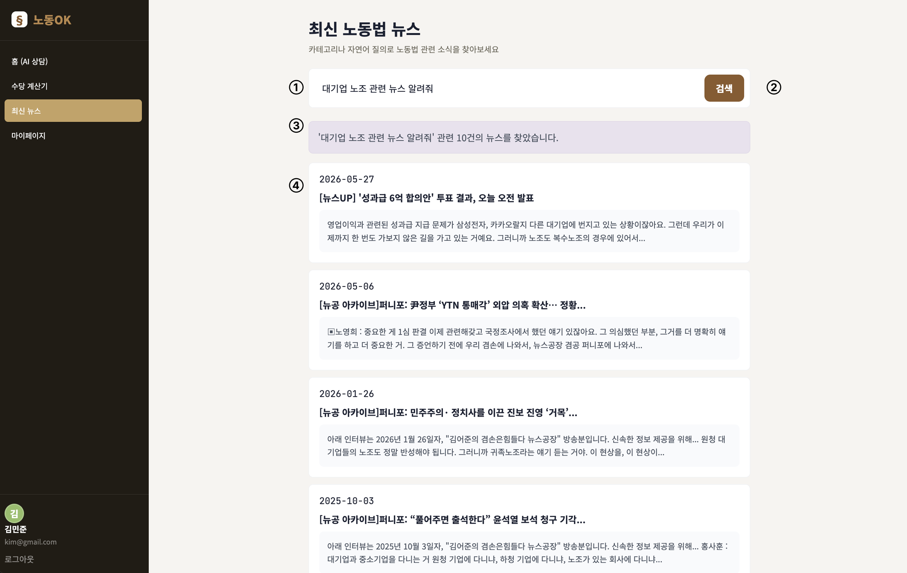

### 화면 설명

사용자가 검색어와 카테고리를 통해 노동법 관련 최신 뉴스 목록과 요약을 확인하는 화면이다.

### UI 요소 명세

| 번호 | 요소명 | 타입 | 설명 |
|---|---|---|---|
| ① | 뉴스 검색 입력란 | Input(text) | 뉴스 검색어 입력 |
| ② | 검색 버튼 | Button(submit) | `/api/news/` GET 호출 |
| ③ | 카테고리 칩 | Button Group | 전체/카테고리별 필터 |
| ④ | 뉴스 요약 박스 | Summary Box | 검색 결과 요약 표시 |
| ⑤ | 뉴스 목록 | Card List | 카테고리, 날짜, 제목, 요약 표시 |

### 기능 / 이벤트 설명

| 이벤트 | 처리 흐름 |
|---|---|
| 검색 제출 | query/category를 URLSearchParams로 구성 → `/api/news/` GET → summary/list 갱신 |
| 카테고리 클릭 | active class 변경 → 선택 카테고리 기준 API 재호출 |
| 결과 없음 | empty-state 메시지 표시 |

### 유효성 검사 / 예외 처리

| 항목 | 내용 |
|---|---|
| 빈 검색어 | 빈 문자열도 API 호출 가능. 설계 보완 시 기본 최신 뉴스 조회로 처리 |
| 결과 없음 | `"관련 뉴스를 찾지 못했습니다"` 표시 |
| API 실패 | 현재 JS에 명시적 catch 없음. 설계 보완 시 `"뉴스를 불러오지 못했습니다."` 표시 |

### 연관 화면

| 조건 | 이동 화면 |
|---|---|
| 사이드바 홈 클릭 | SC-3.1 AI 노동법 상담 |
| 사이드바 계산기 클릭 | SC-3.2 수당 계산기 |
| 사이드바 마이페이지 클릭 | SC-3.4 마이페이지 |

---

## SC-3.4 마이페이지

| 항목 | 내용 |
|---|---|
| URL | `/app/?page=mypage` |
| View | `user_app` |
| Template | `labor/app.html`, `labor/partials/_mypage.html` |
| JS | `static/labor/js/mypage.js` |
| Model / 데이터 | Session `labor_user`, `history` |

### 와이어프레임 캡처

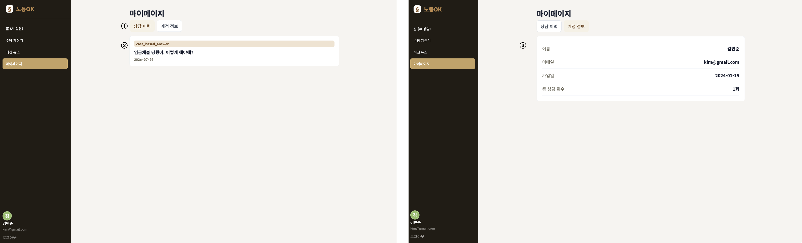

### 화면 설명

사용자의 상담 이력, 즐겨찾기, 계정 정보를 탭으로 확인하는 개인 화면이다.

### UI 요소 명세

| 번호 | 요소명 | 타입 | 설명 |
|---|---|---|---|
| ① | 탭 버튼 | Tabs | 상담 이력, 즐겨찾기, 계정 정보 전환 |
| ② | 상담 이력 목록 | Card List | 과거 질문, 날짜, 카테고리 표시 |
| ③ | 즐겨찾기 빈 상태 | Empty State | 저장된 답변 없음 표시 |
| ④ | 계정 정보 | Definition List | 이름, 이메일, 가입일, 상담 횟수 표시 |

### 기능 / 이벤트 설명

| 이벤트 | 처리 흐름 |
|---|---|
| 탭 클릭 | active class 변경 → 선택 panel만 표시 |

### 유효성 검사 / 예외 처리

| 항목 | 내용 |
|---|---|
| 이력 없음 | 설계 보완 시 `"상담 이력이 없습니다."` 표시 |
| 즐겨찾기 없음 | `"저장된 답변이 없습니다"` 표시 |
| 비로그인 접근 | `/login/`으로 redirect |

### 연관 화면

| 조건 | 이동 화면 |
|---|---|
| 사이드바 홈 클릭 | SC-3.1 AI 노동법 상담 |
| 로그아웃 클릭 | SC-1.1 랜딩 |

---

## SC-4.1 관리자 대시보드

| 항목 | 내용 |
|---|---|
| URL | `/admin-console/?tab=dashboard` |
| View | `admin_console` |
| Template | `labor/admin.html`, `labor/partials/_admin_dashboard.html` |
| Model / 데이터 | `dashboard.dashboard_context()` |

### 와이어프레임 캡처

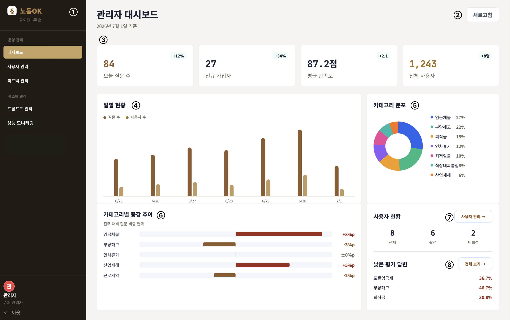

### 화면 설명

관리자가 서비스 운영 현황을 요약 지표, 일별 현황, 카테고리 분포, FAQ, 낮은 평가 답변, 법령 업데이트 공지로 확인하는 화면이다.

### UI 요소 명세

| 번호 | 요소명 | 타입 | 설명 |
|---|---|---|---|
| ① | 관리자 사이드바 | Navigation | 관리자 탭 이동 |
| ② | 새로고침 버튼 | Button | 운영 지표 재조회 용도 |
| ③ | 통계 카드 | Stat Card | 전체 지표와 증감률 표시 |
| ④ | 일별 현황 차트 | Bar Chart | 질문 수/사용자 수 추이 표시 |
| ⑤ | 카테고리 분포 | Meter List | 카테고리별 비율 표시 |
| ⑥ | FAQ TOP 7 | Bar List | 자주 묻는 질문 카테고리 표시 |
| ⑦ | 낮은 평가 답변 | List | 개선 대상 답변 표시 |
| ⑧ | 법령 업데이트 공지 | List | 업데이트 필요 정보 표시 |

### 기능 / 이벤트 설명

| 이벤트 | 처리 흐름 |
|---|---|
| 관리자 탭 클릭 | `/admin-console/?tab={tab}`로 이동 |
| 새로고침 클릭 | 현재는 정적 버튼. 설계 보완 시 dashboard 데이터 재조회 |

### 유효성 검사 / 예외 처리

| 항목 | 내용 |
|---|---|
| 비로그인 접근 | `/login/`으로 redirect |
| 일반 사용자 접근 | `/app/`으로 redirect |

### 연관 화면

| 조건 | 이동 화면 |
|---|---|
| 사용자 관리 클릭 | SC-4.2 사용자 관리 |
| 피드백 관리 클릭 | SC-4.3 피드백 관리 |
| 로그아웃 클릭 | SC-1.1 랜딩 |

---

## SC-4.2 사용자 관리

| 항목 | 내용 |
|---|---|
| URL | `/admin-console/?tab=users` |
| View | `admin_console` |
| Template | `labor/admin.html`, `labor/partials/_admin_users.html` |
| JS | `static/labor/js/admin-users.js` |
| Model / 데이터 | `dashboard.users_context()` |

### 와이어프레임 캡처

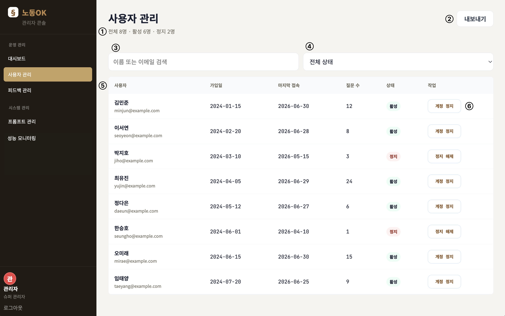

### 화면 설명

관리자가 사용자 목록을 조회하고 이름/이메일 검색, 상태 필터, 계정 상태 변경을 수행하는 화면이다.

### UI 요소 명세

| 번호 | 요소명 | 타입 | 설명 |
|---|---|---|---|
| ① | 사용자 요약 | Text | 전체/활성/정지 사용자 수 표시 |
| ② | 내보내기 버튼 | Button | 사용자 목록 export 용도 |
| ③ | 검색 입력란 | Input(text) | 이름 또는 이메일 검색 |
| ④ | 상태 필터 | Select | 전체/활성/정지 필터 |
| ⑤ | 사용자 테이블 | Table | 사용자, 가입일, 접속일, 질문 수, 상태 표시 |
| ⑥ | 계정 정지/해제 버튼 | Button | 행 단위 상태 변경 |

### 기능 / 이벤트 설명

| 이벤트 | 처리 흐름 |
|---|---|
| 검색 입력 | 행 텍스트에 검색어 포함 여부 확인 → 불일치 행 숨김 |
| 상태 필터 변경 | row의 `data-status`와 선택값 비교 → 필터링 |
| 계정 정지/해제 클릭 | 행의 `data-status`, badge class/text, 버튼 text 변경 |
| 내보내기 클릭 | 현재 정적 버튼. 설계 보완 시 CSV 다운로드 |

### 유효성 검사 / 예외 처리

| 항목 | 내용 |
|---|---|
| 검색 결과 없음 | 설계 보완 시 `"검색 결과가 없습니다."` 표시 |
| 상태 변경 저장 | 현재 클라이언트 상태 변경만 수행. 설계 보완 시 API 저장 실패 시 롤백 |

### 연관 화면

| 조건 | 이동 화면 |
|---|---|
| 대시보드 클릭 | SC-4.1 관리자 대시보드 |
| 피드백 관리 클릭 | SC-4.3 피드백 관리 |

---

## SC-4.3 피드백 관리

| 항목 | 내용 |
|---|---|
| URL | `/admin-console/?tab=feedback` |
| View | `admin_console` |
| Template | `labor/admin.html`, `labor/partials/_admin_feedback.html` |
| JS | `static/labor/js/admin-feedback.js` |
| Model / 데이터 | `dashboard.feedback_context()` |

### 와이어프레임 캡처

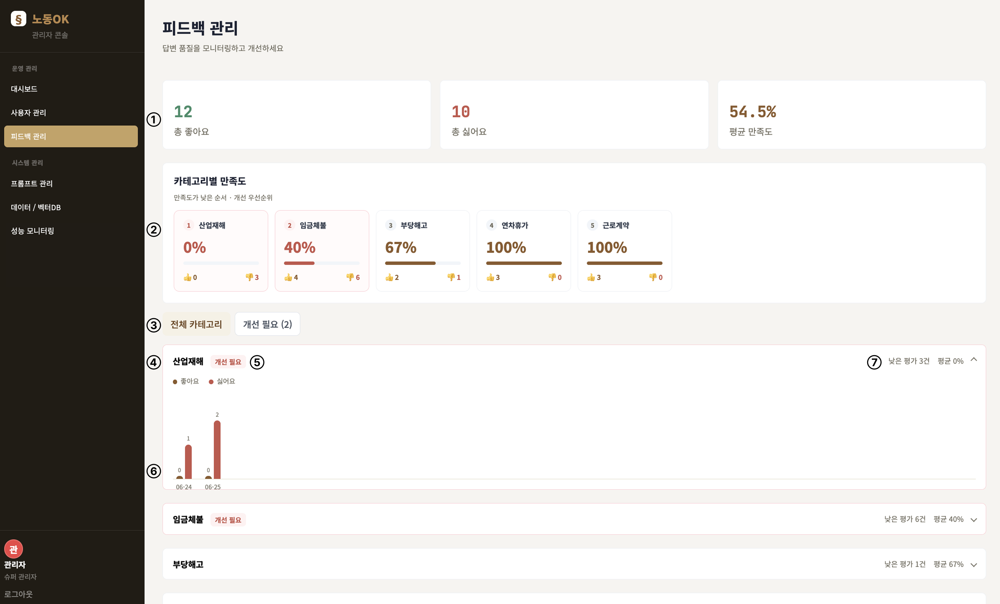

### 화면 설명

AI 답변에 대한 좋아요/싫어요 및 만족도 점수를 확인하고, 낮은 평가 답변을 선별해 개선 메모를 남기는 화면이다.

### UI 요소 명세

| 번호 | 요소명 | 타입 | 설명 |
|---|---|---|---|
| ① | 피드백 요약 카드 | Stat Card | 총 좋아요, 총 싫어요, 평균 만족도 표시 |
| ② | 필터 탭 | Tabs | 전체 답변 / 낮은 평가 전환 |
| ③ | 피드백 카드 | Card List | 카테고리, 질문, 좋아요/싫어요, 점수 표시 |
| ④ | 개선 필요 배지 | Badge | 낮은 점수 답변에 표시 |
| ⑤ | 개선 메모 입력란 | Textarea | 개선 방향 및 수정 내용 기록 |

### 기능 / 이벤트 설명

| 이벤트 | 처리 흐름 |
|---|---|
| 낮은 평가 탭 클릭 | `data-low=true`가 아닌 카드 숨김 |
| 전체 답변 탭 클릭 | 모든 피드백 카드 표시 |
| 메모 입력 | 현재 화면상 입력만 가능. 설계 보완 시 저장 API 필요 |

### 유효성 검사 / 예외 처리

| 항목 | 내용 |
|---|---|
| 낮은 평가 없음 | 설계 보완 시 `"개선 필요 답변이 없습니다."` 표시 |
| 메모 저장 실패 | 설계 보완 시 `"메모 저장에 실패했습니다."` 표시 |

### 연관 화면

| 조건 | 이동 화면 |
|---|---|
| 프롬프트 관리 클릭 | SC-4.4 프롬프트 관리 |
| 사용자 관리 클릭 | SC-4.2 사용자 관리 |

---

## SC-4.4 프롬프트 관리

| 항목 | 내용 |
|---|---|
| URL | `/admin-console/?tab=prompts` |
| View | `admin_console`, `prompt_api` |
| Template | `labor/admin.html`, `labor/partials/_admin_prompts.html` |
| JS | `static/labor/js/admin-prompts.js`, `utils.js` |
| Model / 데이터 | `dashboard.prompts_context()`, prompt API response |

### 와이어프레임 캡처

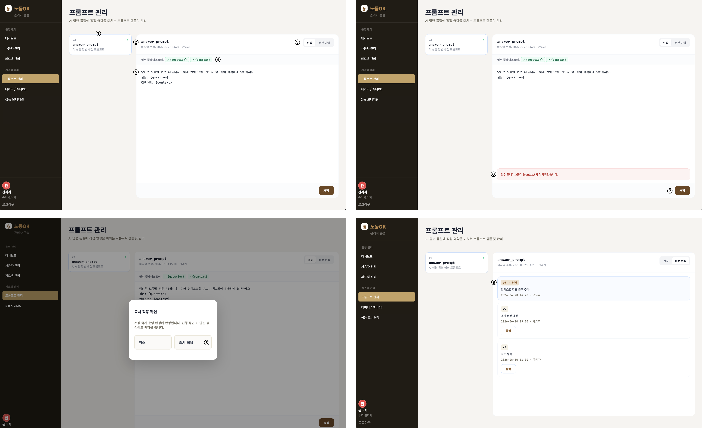

### 화면 설명

관리자가 AI 답변 생성에 사용하는 프롬프트 템플릿을 조회, 편집, 검증, 테스트, 저장, 버전 롤백하는 화면이다.

### UI 요소 명세

| 번호 | 요소명 | 타입 | 설명 |
|---|---|---|---|
| ① | 프롬프트 목록 | Button List | 템플릿 선택 |
| ② | 템플릿 제목/메타 | Text | 이름, 수정일, 수정자 표시 |
| ③ | 편집/버전 이력 탭 | Tabs | 편집 화면과 이력 화면 전환 |
| ④ | placeholder 태그 | Badge List | 필수 변수 포함 여부 표시 |
| ⑤ | 프롬프트 편집기 | Textarea | 템플릿 본문 편집 |
| ⑥ | 오류 메시지 박스 | Notice Box | 검증 오류 표시 |
| ⑦ | 테스트 미리보기 버튼 | Button | 테스트 영역 열기/닫기 |
| ⑧ | 테스트 질의 입력란 | Input(text) | 프롬프트 테스트 질문 입력 |
| ⑨ | 테스트 버튼 | Button | preview API 호출 |
| ⑩ | 저장 버튼 | Button | validate 후 확인 모달 표시 |
| ⑪ | 즉시 적용 확인 모달 | Modal | 저장 전 최종 확인 |
| ⑫ | 버전 이력 목록 | List | 과거 버전 및 롤백 버튼 표시 |

### 기능 / 이벤트 설명

| 이벤트 | 처리 흐름 |
|---|---|
| 템플릿 선택 | `/api/prompts/` POST action=`get` → 제목/본문/placeholders/history 갱신 |
| 편집/이력 탭 클릭 | 선택 panel만 표시 |
| 테스트 미리보기 클릭 | 테스트 입력 영역 hidden 토글 |
| 테스트 버튼 클릭 | 빈 값이면 중단 → action=`test` → 미리보기 결과 표시 |
| 저장 클릭 | action=`validate` → 오류 있으면 오류 박스 표시 → 오류 없으면 확인 모달 표시 |
| 즉시 적용 클릭 | action=`save` → 저장 상태 표시 → 템플릿 재조회 |
| 롤백 클릭 | action=`rollback` → 선택 템플릿 재조회 |

### 유효성 검사 / 예외 처리

| 항목 | 내용 |
|---|---|
| 테스트 질의 | 빈 값이면 API 호출 중단 |
| 프롬프트 검증 | `dashboard.validate_prompt_content()` 오류를 `promptErrors`에 표시 |
| 저장 확인 | 운영 반영 전 확인 모달 표시 |
| API 실패 | 현재 명시적 catch 없음. 설계 보완 시 `"프롬프트 처리 중 오류가 발생했습니다."` 표시 |

### 연관 화면

| 조건 | 이동 화면 |
|---|---|
| 데이터 / 벡터DB 클릭 | SC-4.5 데이터 / 벡터DB 관리 |
| 성능 모니터링 클릭 | SC-4.6 성능 모니터링 |

---

## SC-4.5 데이터 / 벡터DB 관리

| 항목 | 내용 |
|---|---|
| URL | `/admin-console/?tab=vectordb` |
| View | `admin_console` |
| Template | `labor/admin.html`, `labor/partials/_admin_vectordb.html` |
| JS | `static/labor/js/admin-vectordb.js` |
| Model / 데이터 | `dashboard.vectordb_context()` |

### 와이어프레임 캡처

### 화면 설명

법령, 판례, 질의회시 벡터 DB의 상태와 문서 수, 크기, 최근 빌드 일시를 확인하고 재구축 또는 실패 문서 재처리를 수행하는 화면이다.

### UI 요소 명세

| 번호 | 요소명 | 타입 | 설명 |
|---|---|---|---|
| ① | 벡터DB 상태 카드 | Card | DB명, 상태, 문서 수, 크기, 최근 빌드 표시 |
| ② | 재구축 버튼 | Button | 해당 DB 재구축 시뮬레이션/요청 |
| ③ | 진행률 표시줄 | Progress Bar | 재구축 진행률 표시 |
| ④ | 탭 버튼 | Tabs | 업로드 이력 / 임베딩 실패 전환 |
| ⑤ | 업로드 이력 테이블 | Table | 파일명, 유형, 크기, 업로드 일시, 문서 수, 상태 |
| ⑥ | 실패 문서 카드 | Card List | 실패 파일명, 사유, 실패 일시 표시 |
| ⑦ | 재처리 버튼 | Button | 실패 문서 재처리 요청 |

### 기능 / 이벤트 설명

| 이벤트 | 처리 흐름 |
|---|---|
| 재구축 클릭 | 버튼 비활성화 → 진행률 0~100 표시 → 완료 후 정상 상태 표시 |
| 업로드/실패 탭 클릭 | 선택 panel만 표시 |
| 재처리 클릭 | 버튼 비활성화 → 처리 중 표시 → 완료 후 실패 카드 제거 |

### 유효성 검사 / 예외 처리

| 항목 | 내용 |
|---|---|
| 재구축 중 중복 클릭 | 버튼 disabled 처리 |
| 재구축 API 실패 | 현재 catch 후 무시하고 finally 처리. 설계 보완 시 실패 상태 표시 |
| 실패 문서 없음 | `"임베딩 실패 문서가 없습니다"` 표시 |

### 연관 화면

| 조건 | 이동 화면 |
|---|---|
| 프롬프트 관리 클릭 | SC-4.4 프롬프트 관리 |
| 성능 모니터링 클릭 | SC-4.6 성능 모니터링 |

---

## SC-4.6 성능 모니터링

| 항목 | 내용 |
|---|---|
| URL | `/admin-console/?tab=performance` |
| View | `admin_console` |
| Template | `labor/admin.html`, `labor/partials/_admin_performance.html` |
| JS | `static/labor/js/admin-performance.js` |
| Model / 데이터 | `dashboard.performance_context()` |

### 와이어프레임 캡처

### 화면 설명

LangGraph 노드별 처리 시간, LLM/임베딩 API 호출량, 비용, 병목 노드, 응답 시간 초과 질의를 확인하는 운영 모니터링 화면이다.

### UI 요소 명세

| 번호 | 요소명 | 타입 | 설명 |
|---|---|---|---|
| ① | 노드 처리 시간 카드 | Stat Card | 노드명, 호출 수, 평균/최대 처리 시간 |
| ② | 기간 선택 버튼 | Segmented Button | 일/주/월 보기 전환 |
| ③ | API 사용량 카드 | Stat Card | 총 LLM 호출, 토큰 사용량, 예상 비용 |
| ④ | API 호출 차트 | Bar Chart | 일자별 LLM/임베딩 호출 수 |
| ⑤ | 병목 노드 TOP | List/Bar | 노드별 부하 비율 표시 |
| ⑥ | 시간 초과 질의 테이블 | Table | 질문, 사용자, 처리 시간, 병목 노드, 일시 표시 |

### 기능 / 이벤트 설명

| 이벤트 | 처리 흐름 |
|---|---|
| 기간 버튼 클릭 | active class 변경. 설계 보완 시 기간별 데이터 fetch 후 차트 갱신 |

### 유효성 검사 / 예외 처리

| 항목 | 내용 |
|---|---|
| 데이터 없음 | 설계 보완 시 `"모니터링 데이터가 없습니다."` 표시 |
| 기간별 조회 실패 | 설계 보완 시 `"성능 데이터를 불러오지 못했습니다."` 표시 |

### 연관 화면

| 조건 | 이동 화면 |
|---|---|
| 대시보드 클릭 | SC-4.1 관리자 대시보드 |
| 데이터 / 벡터DB 클릭 | SC-4.5 데이터 / 벡터DB 관리 |

---

## 5. 공통 화면 이동 / 권한 규칙

| 구분 | 규칙 |
|---|---|
| 비로그인 사용자 `/app/` 접근 | `/login/`으로 redirect |
| 비로그인 사용자 `/admin-console/` 접근 | `/login/`으로 redirect |
| 일반 사용자 `/admin-console/` 접근 | `/app/`으로 redirect |
| 관리자 `/` 접근 | `/admin-console/`로 redirect |
| 일반 사용자 `/` 접근 | `/app/`으로 redirect |
| 로그아웃 | session `labor_user` 제거 후 `/`로 redirect |

## 6. 공통 API 명세 요약

| API | Method | 호출 화면 | 입력 | 출력 | 예외 처리 설계 |
|---|---|---|---|---|---|
| `/api/advice/` | POST | SC-3.1 | `{ question }` | `{ answer }` | 빈 질문 차단, 실패 시 오류 메시지 |
| `/api/calculate/` | POST | SC-3.2 | `{ mode, calc_type, salary, months, hours }` 또는 `{ mode: "chat", text }` | `{ message, result }` | 숫자 변환 실패 시 기본값, 실패 시 오류 메시지 |
| `/api/news/` | GET | SC-3.3 | `q`, `category` | `{ items, summary }` | 결과 없음 empty-state |
| `/api/prompts/` | POST | SC-4.4 | `{ action, id, content, query, version }` | action별 JSON | validate 오류 표시, 저장 전 확인 모달 |
| `/api/admin/users/toggle-status/` | POST | SC-4.2 | `{ user_id, status }` | `{ ok, user_id, status }` | 사용자 없음 404 |
| `/api/admin/vectordb/rebuild/` | POST | SC-4.5 | `{ id }` | `{ ok, status, db_id }` | 재구축 중 중복 요청 차단 (JS disabled) |
| `/api/admin/vectordb/reprocess/` | POST | SC-4.5 | `{ id }` | `{ ok, failed_id }` | 실패 시 JS catch 처리 |
| `/api/admin/performance/` | GET | SC-4.6 | `period` (query) | `{ langgraph_nodes, llm_usage, total_calls, total_tokens, total_cost }` | 기간 없는 경우 day 기본값 |

## 7. 캡처 이미지 삽입 가이드

캡처 파일은 아래 경로와 파일명으로 저장하면 문서 링크가 바로 연결된다.

| 화면 ID | 캡처 파일명 |
|---|---|
| SC-1.1 | `doc/screenshots/SC-1.1_landing.png` |
| SC-2.1 | `doc/screenshots/SC-2.1_login.png` |
| SC-2.2 | `doc/screenshots/SC-2.2_register.png` |
| SC-3.1 | `doc/screenshots/SC-3.1_advice.png` |
| SC-3.2 | `doc/screenshots/SC-3.2_calculator.png` |
| SC-3.3 | `doc/screenshots/SC-3.3_news.png` |
| SC-3.4 | `doc/screenshots/SC-3.4_mypage.png` |
| SC-4.1 | `doc/screenshots/SC-4.1_admin_dashboard.png` |
| SC-4.2 | `doc/screenshots/SC-4.2_admin_users.png` |
| SC-4.3 | `doc/screenshots/SC-4.3_admin_feedback.png` |
| SC-4.4 | `doc/screenshots/SC-4.4_admin_prompts.png` |
| SC-4.5 | `doc/screenshots/SC-4.5_admin_vectordb.png` |
| SC-4.6 | `doc/screenshots/SC-4.6_admin_performance.png` |
