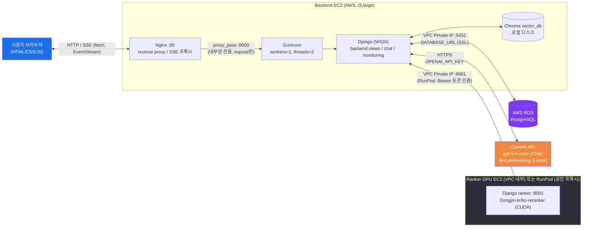
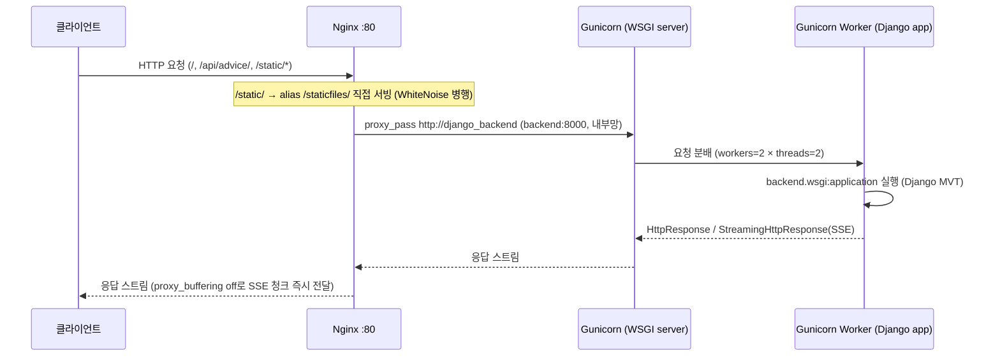
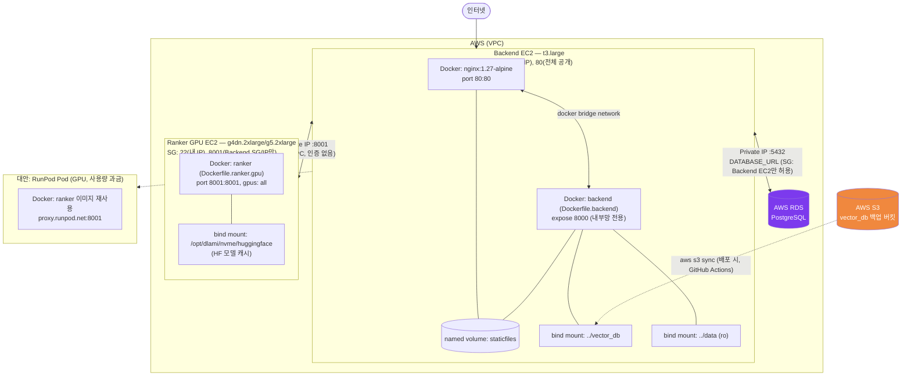

# 노동OK — 시스템 구성도

- 작성일: 2026-07-08
- 대상: 노동OK (GraphRAG 기반 노동법 상담 AI + Django 웹 애플리케이션)
- 근거: `docker/`, `apps/backend/backend/settings.py`, `apps/backend/engine/config.py`, `doc/aws-ec2-two-server-deploy.md`, `doc/runpod-ranker-deploy.md`

## 평가지표 매핑

| 평가 항목 | 확인 내용 | 위치 |
|---|---|---|
| 전체 데이터 흐름 표현 | 클라이언트-서버-DB-외부 LLM API 간 흐름 | [1. 전체 데이터 흐름](#1-전체-데이터-흐름) |
| 배포 아키텍처 표현 | Nginx-Gunicorn-Django(WSGI) 연계 구조 | [2. 배포 아키텍처](#2-배포-아키텍처-nginx--gunicorn--django-wsgi) |
| 클라우드/컨테이너 구성 표현 | AWS 리소스와 Docker 컨테이너·네트워크 관계 | [3. 클라우드·컨테이너 구성](#3-클라우드컨테이너-구성) |
| 보안/확장성 고려 | 보안 그룹, 권한 분리 등 | [4. 보안 및 확장성](#4-보안-및-확장성) |

---

## 1. 전체 데이터 흐름

클라이언트 요청이 Nginx → Gunicorn(Django) → (RDS / 벡터DB / 랭커) → 외부 LLM API 순으로 처리되고, 응답은 SSE로 스트리밍되어 되돌아온다.

**흐름 설명**

1. 사용자가 브라우저에서 `/api/advice/` 등에 fetch 요청을 보낸다 (`static/labor/js/advice.js`).
2. Nginx가 `proxy_buffering off`, `proxy_read_timeout 650s` 설정으로 SSE 스트림을 그대로 통과시킨다 (`docker/nginx.conf:18-29`).
3. Gunicorn → Django `views.advice_api()`(`backend/views.py:375-444`)가 LangGraph 기반 `engine.supervisor`를 백그라운드 스레드로 실행하고, Queue로 진행상황 이벤트를 SSE로 즉시 전달한다.
4. 검색 단계에서 Chroma `vector_db`(로컬 디스크, 볼륨 마운트)로 유사 판례를 조회하고, Ranker 서버(`RANKER_URL`)에 rerank 요청을 보낸다.
5. LLM 단계에서 OpenAI API(`gpt-5.4-nano`, `text-embedding-3-small`)를 `LLM_TIMEOUT_SECONDS`/`LLM_MAX_RETRIES` 설정으로 호출한다 (`engine/config.py:16-30`).
6. 상담 이력은 `ChatHistory` 모델을 통해 AWS RDS(PostgreSQL)에 저장된다 (`DATABASE_URL` 설정 시; 로컬 개발 환경은 미설정 시 SQLite로 자동 대체) (`backend/settings.py:91-107`).

---

## 2. 배포 아키텍처 (Nginx → Gunicorn → Django WSGI)

| 계층 | 구현 | 근거 |
|---|---|---|
| Nginx | 1.27-alpine 컨테이너, 80만 외부 공개 | `docker/docker-compose.backend.aws.yml:1-11` |
| Gunicorn | `gunicorn backend.wsgi:application --bind 0.0.0.0:8000 --workers 2 --threads 2 --timeout 600` | `docker/docker-compose.backend.aws.yml:30-35` |
| Django WSGI | `backend.wsgi.application` | `apps/backend/backend/settings.py:85` |
| 정적 파일 | `collectstatic` → named volume `staticfiles` → Nginx가 `/static/` alias로 서빙 | `docker/docker-compose.backend.aws.yml:28`, `docker/nginx.conf:11-16` |
| 배포 전 마이그레이션 | 컨테이너 시작 커맨드에서 `migrate --noinput` 자동 실행 | `docker/docker-compose.backend.aws.yml:34` |

Ranker(GPU) 서버는 별도 컨테이너에서 동일한 Gunicorn+WSGI 패턴을 쓰지만, GPU 메모리 중복 적재를 막기 위해 `--workers 1 --threads 1 --preload`로 고정한다 (`docker/Dockerfile.ranker.gpu:30`).

---

## 3. 클라우드·컨테이너 구성

두 대의 EC2 인스턴스(또는 Backend EC2 + RunPod GPU Pod 조합)로 역할을 분리하고, 각 인스턴스 내부는 Docker 컨테이너로 구성된다.

| 구성 요소 | 세부 |
|---|---|
| Backend EC2 | `t3.large`(최소 `t3.medium`), Docker Compose로 `nginx` + `backend` 2개 컨테이너 기동 (`docker/docker-compose.backend.aws.yml`) |
| Ranker GPU EC2 | `g4dn.2xlarge`/`g5.2xlarge`(최소 `g4dn.xlarge`), NVIDIA Container Toolkit + `--gpus all`로 컨테이너에 GPU 패스스루 (`docker/docker-compose.ranker-gpu.aws.yml:20-27`) |
| 네트워크 분리 | 두 EC2는 VPC Private IP로 통신(`RANKER_URL=http://RANKER_PRIVATE_IP:8001/rerank/`); Backend 컨테이너는 `expose`만 사용해 호스트에 포트를 게시하지 않고 Nginx만 `80:80`으로 게시 |
| 볼륨 | `staticfiles`(named volume, nginx·backend 공유), `vector_db`/`data`(bind mount, Chroma 검색용), `/opt/dlami/nvme/huggingface`(HF 모델 캐시, Ranker 재시작 시 재다운로드 방지) |
| **AWS RDS** | Django `ChatHistory` 등 관계형 데이터를 담당하는 관리형 PostgreSQL. `DATABASE_URL` 환경변수(`dj_database_url.parse`)로 접속하며, `DB_CONN_MAX_AGE`(커넥션 풀링)·`DB_SSL_REQUIRE`(SSL 강제)를 함께 설정 (`backend/settings.py:91-107`, `doc/rds-postgres-migration.md`) |
| **AWS S3** | 배포 시 GitHub Actions가 `aws s3 sync "$VECTOR_DB_S3_URI" vector_db --delete`로 Chroma `vector_db`를 S3 버킷에서 EC2로 복원 (`.github/workflows/deploy-ec2.yml`, 시크릿 `VECTOR_DB_S3_URI`) |
| GPU 비용 최적화 대안 | 상시 과금 GPU EC2 대신 RunPod Pod로 Ranker만 이전 가능 — 동일 이미지 재사용, `proxy.runpod.net` 공인 프록시 + `RANKER_API_KEY` Bearer 인증 (`doc/runpod-ranker-deploy.md`) |

---

## 4. 보안 및 확장성

### 보안 그룹 / 네트워크 격리

| 인스턴스 | 포트 | 허용 대상 | 목적 |
|---|---|---|---|
| Backend EC2 | 22 (SSH) | 관리자 IP만 | 원격 관리 접근 최소화 |
| Backend EC2 | 80 (HTTP) | 전체 공개 | 사용자 웹 서비스 진입점 (Nginx만 노출, 컨테이너 내부 8000은 게시하지 않음) |
| Ranker GPU EC2 | 22 (SSH) | 관리자 IP만 | 원격 관리 접근 최소화 |
| Ranker GPU EC2 | 8001 | Backend EC2 보안그룹/Private IP만 | 랭커 API를 내부망으로 한정, 외부 전체 공개 금지 |
| AWS RDS | 5432 | Backend EC2 보안그룹만 | DB를 VPC 내부망으로 한정, 외부 전체 공개 금지 |

- Nginx 도입으로 `backend` 컨테이너는 `expose: 8000`만 사용 → 공격 표면 축소 (`docker/docker-compose.backend.aws.yml:17-18`).
- Ranker를 RunPod처럼 공인 네트워크로 노출해야 하는 경우, VPC 내부망 신뢰 대신 `Authorization: Bearer <RANKER_API_KEY>` 애플리케이션 레벨 인증을 추가해 대체 (`apps/ranker/ranker/views.py:28-32`, `apps/backend/engine/nodes/retrieval.py:16-24`).
- RDS는 퍼블릭 액세스를 차단하고 Backend EC2 보안그룹에서만 5432 인바운드를 허용하며, `DB_SSL_REQUIRE`로 전송 구간 암호화를 강제할 수 있다 (`backend/settings.py:98`, `doc/rds-postgres-migration.md`).

### 권한 분리 / 애플리케이션 보안

| 항목 | 구현 | 근거 |
|---|---|---|
| 로그인 실패 잠금 | 5회 실패 시 10분 계정 잠금 | `backend/views.py:91-136` |
| 세션 만료 | 60분 유휴 타임아웃, 요청마다 갱신 | `backend/settings.py:141-143` |
| 관리자 전용 접근 제어 | 관리자 콘솔 뷰에서 권한 검사 | `backend/views.py:251-252` |
| IDOR 방지 | 본인 소유 데이터만 조회 가능하도록 필터링 | `backend/views.py:520-523` |
| 프록시 신뢰 헤더 | `USE_X_FORWARDED_HOST`, `SECURE_PROXY_SSL_HEADER`로 Nginx 뒤에서 HTTPS/Host 정보 신뢰 | `backend/settings.py:36-37` |
| 시크릿 관리 | `.env` + `python-decouple` 환경변수 분리, `.env.example` 템플릿화 | `backend/settings.py:14, 25, 28` |
| 마이크로서비스 간 인증 | Ranker API에 Bearer 토큰 검증 (공인망 노출 시) | `apps/ranker/ranker/views.py:28-32` |

### 확장성 고려

- **역할 분리 확장**: Django 백엔드(CPU)와 GPU 랭커를 별도 인스턴스로 분리해 두 리소스를 독립적으로 스케일링 가능 (GPU는 고가이므로 필요 시에만 별도 확장).
- **GPU 워커 고정**: 랭커는 모델이 워커마다 GPU 메모리에 복제되는 것을 막기 위해 Gunicorn `--workers 1`로 고정하고, 대신 `RERANKER_BATCH_SIZE`로 처리량을 조절 (`docker/Dockerfile.ranker.gpu:30`, `doc/aws-ec2-two-server-deploy.md:180-199`).
- **사용량 기반 과금 전환**: 상시 과금되는 GPU EC2 대신 RunPod Pod(사용량 기반)로 전환 가능한 배포 경로 마련 (`doc/runpod-ranker-deploy.md`).
- **DB 확장 경로 (RDS, 적용됨)**: `dj_database_url` 기반 설정으로 `DATABASE_URL` 환경변수에 RDS 엔드포인트를 지정해 PostgreSQL(AWS RDS)로 무중단 전환 가능하도록 설계됨 (`backend/settings.py:91-107`). 로컬 개발 환경은 `DATABASE_URL` 미설정 시 SQLite로 자동 대체되어 별도 DB 없이도 개발 가능. 커넥션 풀링(`DB_CONN_MAX_AGE`)·SSL 강제(`DB_SSL_REQUIRE`) 옵션 포함, 상세 절차는 `doc/rds-postgres-migration.md` 참고.
- **벡터 DB 백업/복원 경로 (S3, 적용됨)**: Chroma `vector_db`는 EC2 로컬 디스크(bind mount)에만 두지 않고, 배포 파이프라인이 매번 S3 버킷에서 `aws s3 sync`로 최신본을 내려받아 복원 — 인스턴스 교체·재생성에도 벡터 인덱스가 유실되지 않음 (`.github/workflows/deploy-ec2.yml`).
- **정적 자원 확장 경로**: 현재는 WhiteNoise + Nginx `/static/` alias 조합이며, 트래픽 증가 시 `django-storages` + S3/CloudFront로 전환 가능 (미적용).

> RDS(관계형 데이터)와 벡터 DB 백업용 S3 동기화는 이미 적용됨. 정적 자원용 S3(django-storages)만 아직 적용되지 않은 "예정된 확장 경로"로 남아 있음. 자세한 현황은 `doc/개발된_LLM_연동_웹_애플리케이션.md`의 [미구현/설계 차이 정리] 참고.
